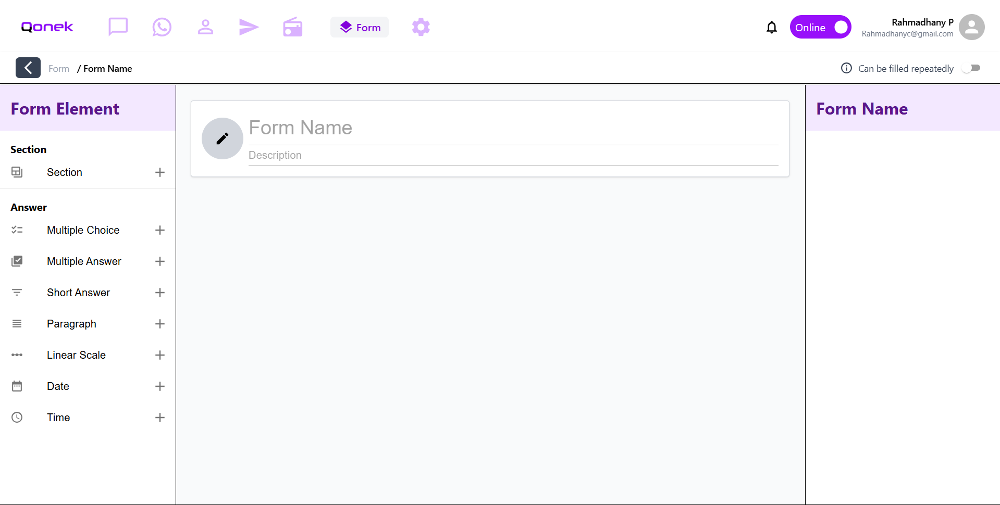
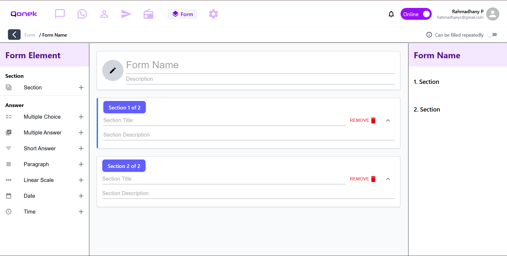

# 🧩 Front-End Form Builder (Internship Test Project)

This is a **React + TypeScript** based interactive form builder created for my internship technical test. It allows users to dynamically build and manage multi-section forms with a live preview panel.

## ✨ Features

- Built with **React**, **TypeScript**, **Vite**, **Material UI (MUI)**, and **Tailwind CSS**
- Supports **7 different question types**
- Dynamic form section builder
- Live preview panel showing the current form's structure
- Real-time question and section updates

## 🧠 Tech Stack

- **React**
- **TypeScript**
- **Vite**
- **Tailwind CSS**
- **Material UI (MUI)**

## 📸 Screenshot / Preview




## 🚀 How to Run

1. Clone the repository:
```bash
git clone https://github.com/yourusername/Front-End-Form-with-React.git
cd Front-End-Form-with-React/MyForm
```

2. Install Depedency
```bash
npm install @mui/material @emotion/react @emotion/styled
npm install @mui/material @mui/styled-engine-sc styled-components
npm install @mui/icons-material
npm install tailwindcss @tailwindcss/vite
```

3. Start the development server with Vite:
```bash
npm run dev
```

## 📌 Notes
This project was built as part of an internship assessment. I had only learned React, MUI, and Tailwind CSS shortly before working on this, and I completed it in just three days total. Because of that, the code might be not the best, a bit unorganized or unstructured — but it's all part of my learning progress and growth. Tailwind CSS and MUI were both used to speed up styling and component layout. The project uses Vite for a fast development experience. The main challenge was to implement a flexible form generator that previews data structure and UI together in real time.